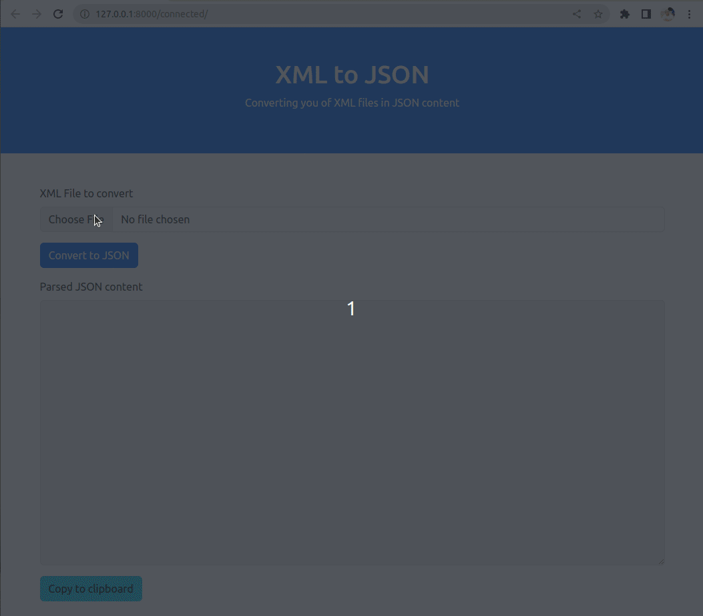
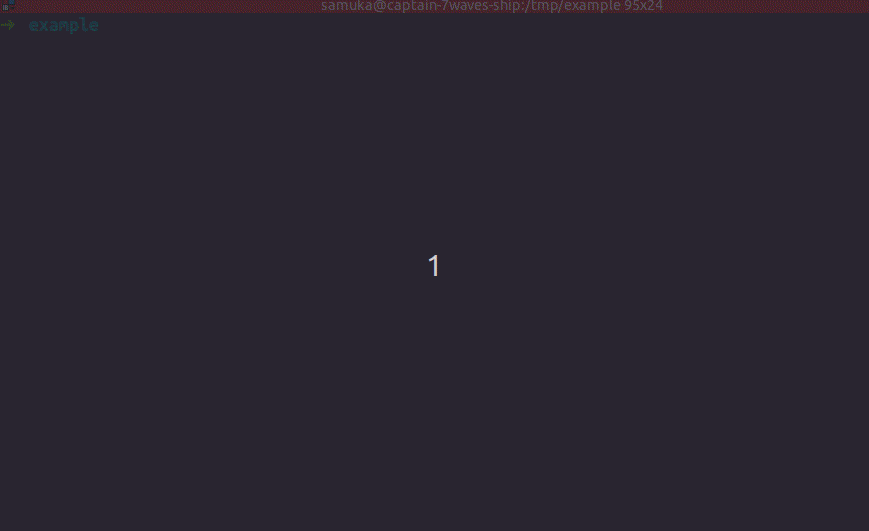

# django_xml2json
A sample Django application of an xml to json converter

 

## Install
Execute commands on terminal:
```sh
# clone this repository
git clone https://github.com/samukasmk/django_xml2json.git

# access new folder
cd django_xml2json

# create new virtualenv
python3 -m venv ./venv
source ./venv/bin/activate

# install required libraries
pip install -r requirements.txt

# run the webserver (in developement mode)
./manage.py runserver
```



# Using web app
Access the local URL: [http://127.0.0.1:8000/connected/]( http://127.0.0.1:8000/connected/)

And enjoy it! 🎉

# Parsing by Rest Framework API

Create a sample file:
```sh
cat > address.json << EOF
<?xml version="1.0"?>
<Root>
    <Address>
        <StreetLine1>123 Main St.</StreetLine1>
        <StreetLine2>Suite 400</StreetLine2>
        <City>San Francisco</City>
        <State>CA</State>
        <PostCode>94103</PostCode>
    </Address>
    <Address>
        <StreetLine1>400 Market St.</StreetLine1>
        <City>San Francisco</City>
        <State>CA</State>
        <PostCode>94108</PostCode>
    </Address>
</Root>
EOF
```

Upload with `curl` command:
```sh
curl -F file=@address.json http://127.0.0.1:8000/api/converter/convert/       
```

```sh
{"Root":[{"Address":[{"StreetLine1":"123 Main St."},{"StreetLine2":"Suite 400"},{"City":"San Francisco"},{"State":"CA"},{"PostCode":"94103"}]},{"Address":[{"StreetLine1":"400 Market St."},{"City":"San Francisco"},{"State":"CA"},{"PostCode":"94108"}]}]}
```


## Testing
You can run tests my `django manage` command:

```sh
./manage.py test
```

```sh
Found 22 test(s).
Creating test database for alias 'default'...
System check identified no issues (0 silenced).
......................
----------------------------------------------------------------------
Ran 22 tests in 0.088s

OK
Destroying test database for alias 'default'...
```

Or run a specific test with `python unittest` library
```sh
DJANGO_SETTINGS_MODULE=exercise.tests_settings python -m unittest -k xml_converter.tests.XMLConversionTestCase.test_connected_convert_addresses
```

```sh
.
----------------------------------------------------------------------
Ran 1 test in 0.195s

OK
```